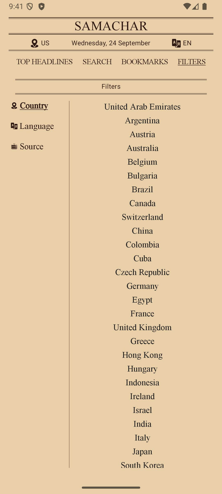
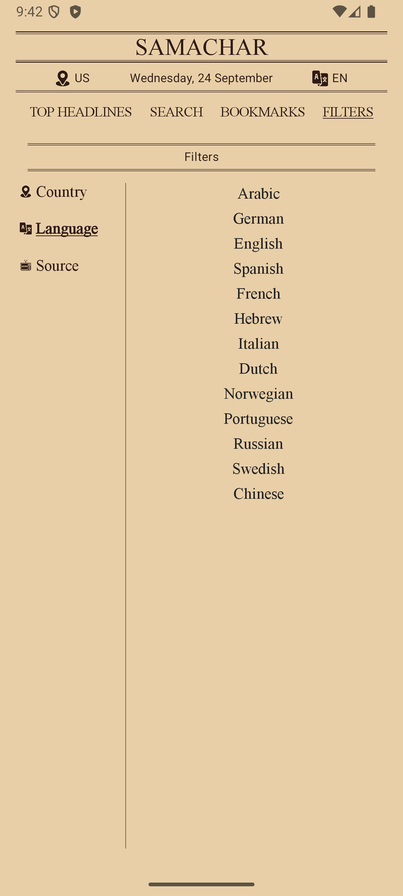
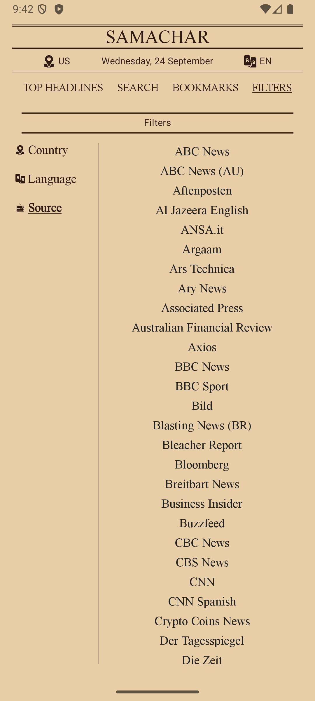

# Samachar - Vintage News App

**News, Vintage Style.**

Samachar is a modern Android news application that brings news consumption back to its roots with a
vintage newspaper-inspired design. Built using cutting-edge Android technologies, it delivers a
unique reading experience while maintaining excellent performance and user experience.

## Screenshots

Here's what the app looks like in action:

<div align="center">
  
  
  
  
  
  
</div>

## Features

- **Vintage Newspaper UI**: Classic newspaper design with elegant typography and layout
- **Smart Search**: Quick search functionality to find news articles
- **Advanced Filtering**: Filter news by country, language, and source
- **Category Navigation**: Browse through different news categories
- **Bookmarking**: Save articles for later reading
- **Regional News**: Get news specific to your region
- **Multi-language Support**: Read news in multiple languages
- **Offline Reading**: Cached articles for offline access

## Architecture

Samachar follows **Clean Architecture** principles with **MVVM (Model-View-ViewModel)** pattern,
ensuring maintainable, testable, and scalable code.

### Architecture Layers

```
┌─────────────────────────────────────────┐
│                UI Layer                 │
│  ┌─────────────┐    ┌─────────────────┐ │
│  │  Compose UI │    │   ViewModels    │ │
│  │   Screens   │◄──►│   (MVVM)       │ │
│  └─────────────┘    └─────────────────┘ │
└─────────────────────────────────────────┘
                        │
                        ▼
┌─────────────────────────────────────────┐
│              Domain Layer               │
│  ┌─────────────┐    ┌─────────────────┐ │
│  │  Use Cases  │    │   Repository    │ │
│  │ (Business   │◄──►│   Interfaces    │ │
│  │   Logic)    │    │                 │ │
│  └─────────────┘    └─────────────────┘ │
└─────────────────────────────────────────┘
                        │
                        ▼
┌─────────────────────────────────────────┐
│               Data Layer                │
│  ┌─────────────┐    ┌─────────────────┐ │
│  │ Repository  │    │  Data Sources   │ │
│  │Implementa-  │◄──►│ Remote & Local  │ │
│  │    tion     │    │                 │ │
│  └─────────────┘    └─────────────────┘ │
└─────────────────────────────────────────┘
```

### MVVM Implementation

The app uses **Model-View-ViewModel** pattern:

- **Model**: Data classes and repository implementations handle data operations
- **View**: Jetpack Compose UI screens observe ViewModel state
- **ViewModel**: Manages UI state and handles business logic through use cases

### Clean Architecture Benefits

- **Separation of Concerns**: Each layer has a single responsibility
- **Testability**: Easy to unit test individual components
- **Maintainability**: Changes in one layer don't affect others
- **Scalability**: Easy to add new features without breaking existing code

## Tech Stack

### Core Technologies

- **Kotlin**: 100% Kotlin codebase
- **Jetpack Compose**: Modern declarative UI toolkit
- **Hilt**: Dependency injection framework
- **Coroutines**: Asynchronous programming
- **Room Database**: Local data persistence

### Networking & Data

- **Retrofit**: Type-safe HTTP client
- **OkHttp**: Efficient HTTP connections
- **Gson**: JSON serialization/deserialization
- **Coil**: Image loading library

### Architecture Components

- **ViewModel**: UI-related data holder
- **Navigation Component**: In-app navigation
- **Repository Pattern**: Data access abstraction

### Development Tools

- **Gradle Version Catalog**: Centralized dependency management
- **Kotlin DSL**: Type-safe build scripts

## Project Structure

```
app/
├── src/main/java/com/amangarg/samachar/
│   ├── data/                    # Data Layer
│   │   ├── mappers/            # Data mapping utilities
│   │   ├── remote/             # Network data sources
│   │   └── repository/         # Repository implementations
│   │
│   ├── domain/                 # Domain Layer
│   │   ├── model/              # Domain models
│   │   ├── repository/         # Repository interfaces
│   │   └── usecase/            # Business logic use cases
│   │
│   ├── ui/                     # UI Layer
│   │   ├── activity/           # Main activity & ViewModel
│   │   ├── composable/         # Reusable UI components
│   │   ├── navigation/         # Navigation setup
│   │   ├── theme/              # App theming
│   │   └── viewmodel/          # Screen ViewModels
│   │
│   ├── di/                     # Dependency Injection
│   │   ├── module/             # Hilt modules
│   │   └── qualifier/          # DI qualifiers
│   │
│   ├── util/                   # Utility classes
│   └── SamacharApp.kt         # Application class
```

## Key Components

### Data Sources

- **Remote**: NewsAPI integration for fetching latest news
- **Local**: Room database for caching and bookmarks

### Use Cases

- Get top headlines
- Search news articles
- Manage bookmarks
- Filter by region/language

### UI Screens

- News feed with vintage styling
- Advanced search interface
- Filter selection screens
- Article detail view

## Getting Started

1. **Clone the repository**
   ```bash
   git clone https://github.com/amangarg95/Samachar.git
   ```

2. **Open in Android Studio**
    - Ensure you have Android Studio Arctic Fox or newer
    - Open the project and sync Gradle files

3. **Get NewsAPI Key**
    - Visit [NewsAPI](https://newsapi.org/) and get your free API key
    - The key is already configured in the build file for development

4. **Build and Run**
    - Connect your Android device or start an emulator
    - Run the app using Android Studio

## Requirements

- **Min SDK**: 24 (Android 7.0)
- **Target SDK**: 36
- **Compile SDK**: 36
- **Java Version**: 11

## Testing

The project includes comprehensive testing setup:

- **Unit Tests**: JUnit, Mockito for business logic testing
- **Instrumentation Tests**: AndroidX Test for UI testing
- **Compose Tests**: Testing Compose UI components

## Future Enhancements

- Dark mode support
- Push notifications for breaking news
- Social sharing capabilities
- Reading progress tracking
- Voice news reading
- Podcast integration

## License

This project is open source and available under the [MIT License](LICENSE).

## Developer

Created with ❤️ by [Aman Garg](https://github.com/amangarg95)

---

*Samachar brings the charm of vintage newspapers to the digital age while leveraging modern Android
development practices.*
